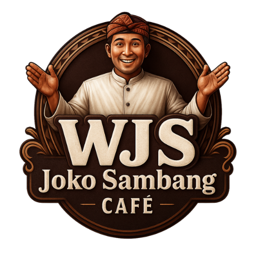

<div align="center">



# ☕ WJS Joko Sambang Café

### Company Profile Website dengan Nuansa Jawa Modern

Website company profile untuk cafe bertema **Jawa Modern** di Junrejo, Kota Batu, Jawa Timur.<br>
Dibangun dari nol dengan Next.js 16, fokus pada pengalaman visual dan performa di perangkat mobile.

[](https://nextjs.org)
[](https://www.typescriptlang.org)
[](https://tailwindcss.com)
[](https://www.framer.com/motion/)
[](https://vercel.com)

**[🌐 Lihat Website](https://wjs-joko-sambang.vercel.app/)** • **[📄 Dokumentasi Teknis](DESCRIPTION.md)** • **[📋 Company Profile PDF](https://online.fliphtml5.com/wjsjokosambang/Company-profile-Wjs-revisi/#p=1)**

</div>

---

## 📖 Tentang Project

WJS Joko Sambang Café adalah cafe dan resto di kaki pegunungan Kota Batu yang mengusung konsep
harmoni antara cita rasa tradisional, suasana alam yang asri, dan pelayanan modern. Nama
"Sambang" sendiri berarti berkunjung dalam bahasa Jawa, melambangkan tempat yang hangat untuk
siapa saja yang datang.

Website ini dibangun untuk memperkuat posisi brand tersebut secara digital: menampilkan menu
andalan, fasilitas ruangan, dokumentasi event, sampai alur reservasi yang langsung terhubung ke
WhatsApp admin.

> 💡 **Konteks bisnis:** Website ini dipakai sebagai wajah digital
> resmi cafe untuk menjangkau empat segmen pengunjung sekaligus: remaja, pekerja, keluarga, dan
> komunitas atau event organizer.

---

## ✨ Fitur Utama

### 🏠 Home
Hero section dengan slider suasana pegunungan, kinetic typography yang muncul kata demi kata,
tiga pilar brand, preview menu best seller, sekilas fasilitas, slider testimoni, dan popup promo
yang bisa diatur isinya lewat satu file data.

### 🌿 About Us
Cerita di balik nama "Joko Sambang", filosofi Jawa Modern, visi dan misi cafe, serta dokumentasi
kunjungan kehormatan Bapak Wali Kota Batu saat grand opening.

### 🍽️ Menu & Culinary
Best seller dengan filter interaktif, tujuh kategori menu berupa panel yang melebar saat diklik,
daftar paket harga (buffet, meal box, ala carte), plus paket wedding lengkap dengan tiga tier.

### 🏡 Facilities & Spaces
Showcase area indoor dan outdoor, ruang VIP dan event, coverflow venue dengan efek 3D, dan
daftar layanan pendukung seperti live music dan event space.

### 📸 Gallery & Events
Dokumentasi kolaborasi event (Beauty Class Wardah, Meeting Pemuda Pemudi), galeri foto masonry
dengan lightbox, dan kompilasi testimoni pengunjung.

### 📞 Contact & Reservation
Form reservasi yang menyusun data isian menjadi pesan WhatsApp rapi, lengkap dengan pratinjau
pesan sebelum dikirim, kartu informasi kontak, dan peta lokasi.

---

## 🎯 Keputusan Teknis yang Menarik

Bagian ini yang menurut saya paling layak dibahas, karena tiap keputusan punya alasan di
baliknya, bukan sekadar ikut tren.

### 1. Animasi 3D tanpa three.js

Efek tilt, perspective, dan coverflow di website ini dibuat murni dengan **CSS transform**
(`perspective`, `rotateX`, `rotateY`) yang digerakkan Framer Motion. Alasannya isi website ini
foto dan teks, bukan model 3D. Menambahkan three.js berarti menambah ratusan KB bundle demi efek
yang bisa dicapai lewat CSS. Mayoritas pengunjung cafe ini membuka website dari HP, jadi setiap
KB itu berarti. Seluruh logikanya dipusatkan di satu komponen: `components/ui/TiltCard.tsx`.

### 2. Data dipisah total dari komponen

Tidak ada satu pun teks, harga, atau nama menu yang ditulis langsung di dalam komponen React.
Semuanya ditarik dari file di folder `lib/`. Ini bukan cuma soal kerapian: struktur ini disiapkan
supaya migrasi ke Headless CMS nanti tinggal mengganti sumber datanya, tanpa menyentuh satu baris
pun kode tampilan.

| File | Isi |
|------|-----|
| `lib/constants.ts` | Alamat, WhatsApp, jam buka, sosial media, struktur navbar |
| `lib/menu-data.ts` | Best seller, tujuh kategori menu, paket harga |
| `lib/wedding-data.ts` | Tiga tier wedding, fasilitas venue, syarat dan ketentuan |
| `lib/facilities-data.ts` | Ruangan, kapasitas, layanan pendukung |
| `lib/events-data.ts` | Dokumentasi event dan foto galeri |
| `lib/testimonials-data.ts` | Ulasan pengunjung |
| `lib/promo-data.ts` | Isi popup promo halaman depan |

### 3. Reservasi tanpa backend

Sesuai roadmap tahap satu di PRD, form reservasi sengaja tidak pakai database. Data isian disusun
menjadi pesan WhatsApp terformat lalu langsung membuka chat admin. Hasilnya: nol biaya server,
nol maintenance, dan admin cafe tetap menerima notifikasi lewat aplikasi yang sudah mereka pakai
setiap hari. Solusi paling sederhana yang benar-benar menyelesaikan masalah.

### 4. Sistem placeholder foto

Frontend mulai dikerjakan sebelum dokumentasi foto asli selesai. Daripada menunggu, dibuat sistem
manifest berisi 63 kebutuhan foto beserta dimensinya, lalu placeholder di-generate otomatis.
Begitu foto asli siap, tinggal ditimpa dengan nama file yang sama persis, tanpa mengubah kode
sedikit pun.

### 5. Pipeline optimasi gambar

Ada skrip `scripts/optimize-images.mjs` yang menurunkan ukuran folder foto sampai sekitar 90
persen tanpa perbedaan yang kasat mata. Skrip ini mencatat file yang sudah pernah diproses, jadi
aman dijalankan berulang kali setiap ada tambahan foto baru, dan menyimpan versi aslinya ke
folder cadangan.

---

## 🛠️ Tech Stack

| Kategori | Teknologi | Alasan Dipilih |
|----------|-----------|----------------|
| Framework | Next.js 16 (App Router) | SSG untuk kecepatan, routing berbasis folder, optimasi gambar bawaan |
| Bahasa | TypeScript | Menangkap kesalahan sejak saat menulis, bukan saat website sudah live |
| Styling | Tailwind CSS v4 | Konfigurasi CSS-first, tanpa file config JS yang gemuk |
| Animasi | Framer Motion | Scroll reveal, kinetic typography, page transition |
| Icon | lucide-react | Ringan dan konsisten. Icon brand dibuat custom karena sudah tidak disediakan |
| Gambar | next/image + sharp | Konversi WebP otomatis, lazy loading, kompresi di tahap build |
| Hosting | Vercel | Deploy otomatis tiap push, CDN global, gratis untuk skala ini |

---

## 🚀 Menjalankan di Lokal

```bash
# 1. Clone repository
git clone https://github.com/USERNAME/wjs-joko-sambang.git
cd wjs-joko-sambang

# 2. Install dependency
npm install

# 3. Jalankan development server
npm run dev
```

Buka [http://localhost:3000](http://localhost:3000) di browser.

Perintah lain yang tersedia:

```bash
npm run build   # build untuk production
npm run lint    # cek ESLint
npm run start   # jalankan hasil build production
```

### Optimasi foto sebelum deploy

```bash
node scripts/optimize-images.mjs             # mode aman, hasil ke public/images-optimized
node scripts/optimize-images.mjs --replace   # timpa public/images, versi asli masuk cadangan
```

---

## 📁 Struktur Folder

```
app/                    Halaman (App Router), satu folder satu route
├── page.tsx            Home
├── about/              Tentang kami
├── menu/               Menu dan paket
├── facilities/         Fasilitas dan ruangan
├── gallery/            Event, galeri, testimoni
└── contact/            Kontak dan reservasi

components/
├── layout/             Navbar dan Footer, dipakai di semua halaman
├── ui/                 Komponen kecil yang dipakai berulang (TiltCard, Logo, dst)
├── home/               Section khusus halaman depan
├── menu/               Section khusus halaman menu
└── contact/            Form reservasi dan peta

lib/                    Seluruh data konten dan helper
public/images/          Aset foto, dikelompokkan per kategori
scripts/                Generator placeholder, checklist aset, optimasi gambar
```

---

## 📊 Progress Pengerjaan

Dikerjakan bertahap mengikuti PRD, satu step selesai dan disetujui dulu sebelum lanjut.

| Step | Modul | Status |
|:----:|-------|:------:|
| 1 | Layout Core & Navigation | ✅ |
| 2 | Home Page | ✅ |
| 3 | About Us Page | ✅ |
| 4 | Menu & Culinary Page | ✅ |
| 5 | Facilities & Spaces Page | ✅ |
| 6 | Events & Gallery Page | ✅ |
| 7 | Contact & Reservation Page | ✅ |
| + | Popup Promo & Wedding Package | ✅ |

---

## 🗺️ Roadmap Berikutnya

- [ ] 🧩 Integrasi Headless CMS (Sanity, Strapi, atau Supabase) supaya admin cafe bisa mengubah
      menu, harga, dan galeri sendiri tanpa lewat developer
- [ ] 📅 Sistem reservasi otomatis dengan ketersediaan slot real time
- [ ] 💳 Pembayaran DP lewat Midtrans atau Xendit
- [ ] 🔍 Optimasi SEO lokal untuk kata kunci seputar kuliner dan tempat meeting di Kota Batu

---

## 📌 Catatan

- Dokumentasi teknis yang lebih detail ada di **[DESCRIPTION.md](DESCRIPTION.md)**
- Daftar lengkap kebutuhan aset foto ada di **ASSET_CHECKLIST.md**
- Spesifikasi produk lengkap ada di **PRD-JokoSambang-CompanyProfile.md**

---

## 👤 Developer

Dikerjakan oleh **Muhammad Akbar Suharbi** sebagai bagian dari pengembangan ekosistem bisnis WJS Joko Sambang Café, Kota Batu.

<div align="center">

**WJS Joko Sambang Café**

📍 Jl. Trunojoyo Dsn. Rejoso, RT.03/RW.10, Junrejo, Kota Batu, Jawa Timur 65321<br>
📱 0853-8527-5390<br>
📷 [@wjs_jokosambang](https://instagram.com/wjs_jokosambang) • 🎵 [@jokosambang](https://tiktok.com/@jokosambang)

<br>

Kalau repo ini menarik buat kamu, jangan lupa kasih ⭐

</div>
